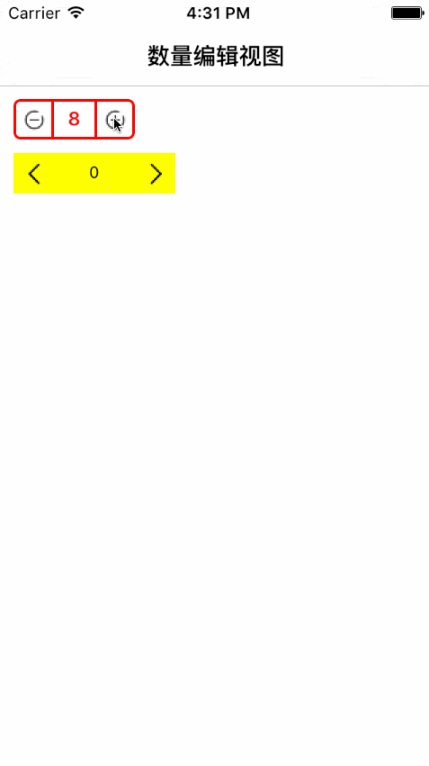

# SYNumberEditView
数量编辑视图控件（如购物车中商品数量的增减）

# 效果图

# 代码示例
~~~ javascript
#import "SYNumberEditView.h"

SYNumberEditView *numberView = [[SYNumberEditView alloc] initWithFrame:CGRectMake(10.0, 10.0, 80.0, 30.0)];
[self.view addSubview:numberView];
numberView.tag = 1000;
numberView.backgroundColor = [UIColor whiteColor];
// 按钮
numberView.reduceImageNormal = [UIImage imageNamed:@"reduceCircle_Normal"];
numberView.reduceImageHighlight = [UIImage imageNamed:@"reduceCircle_Highlight"];
numberView.addImageNormal = [UIImage imageNamed:@"addCircle_Normal"];
numberView.addImageHighlight = [UIImage imageNamed:@"addCircle_Highlight"];
// 字体
numberView.textColor = [UIColor redColor];
numberView.textFont = [UIFont boldSystemFontOfSize:14.0];
// 数量
numberView.numberMax = 20;
numberView.numberEdit = ^(NSInteger number){
    NSLog(@"1 number = %@", @(number));
};
// 边框
numberView.borderShow = YES;
numberView.borderColor = [UIColor redColor];
numberView.borderWidth = 2.0;
numberView.borderCornerRadius = 5.0;
~~~

~~~ javascript
- (void)touchesBegan:(NSSet<UITouch *> *)touches withEvent:(UIEvent *)event
{
    SYNumberEditView *numberView = (SYNumberEditView *)[self.view viewWithTag:1000];
    NSLog(@"2 number = %@", @(numberView.number));
}
~~~